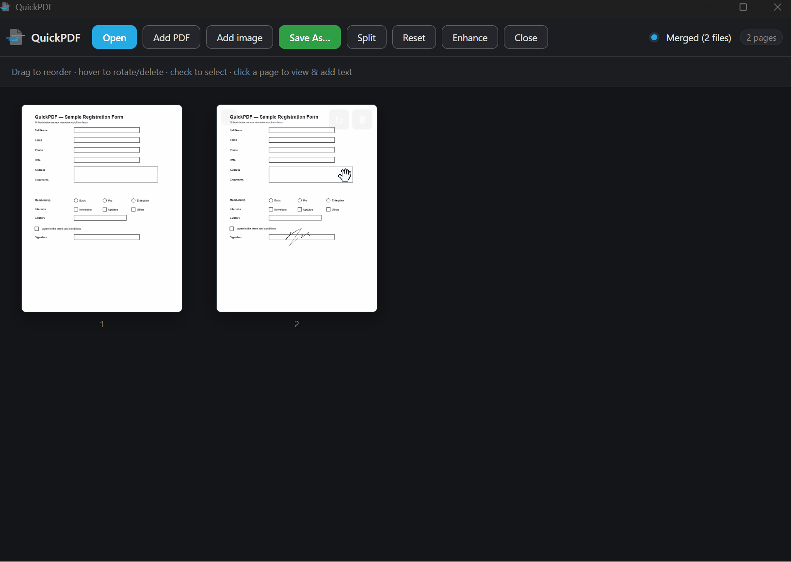
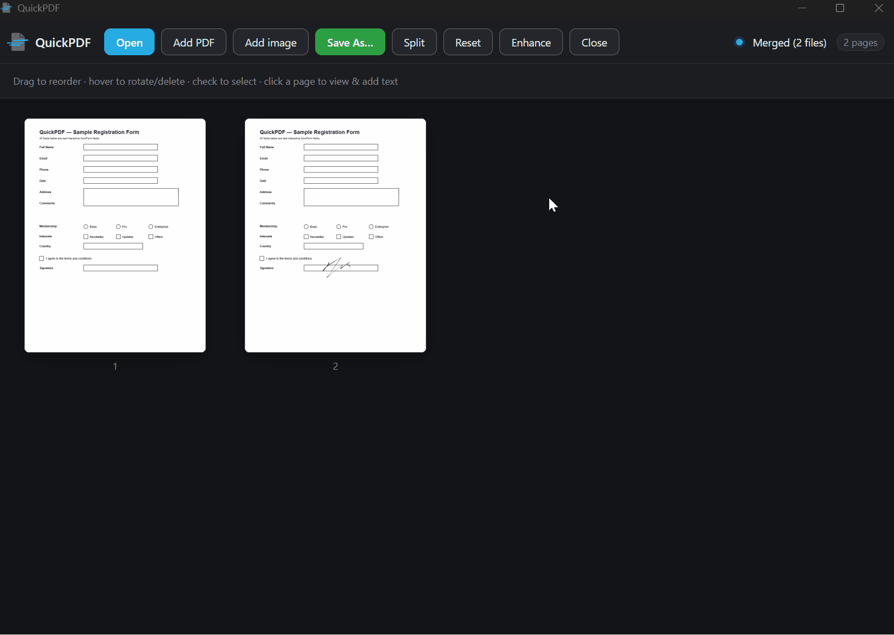
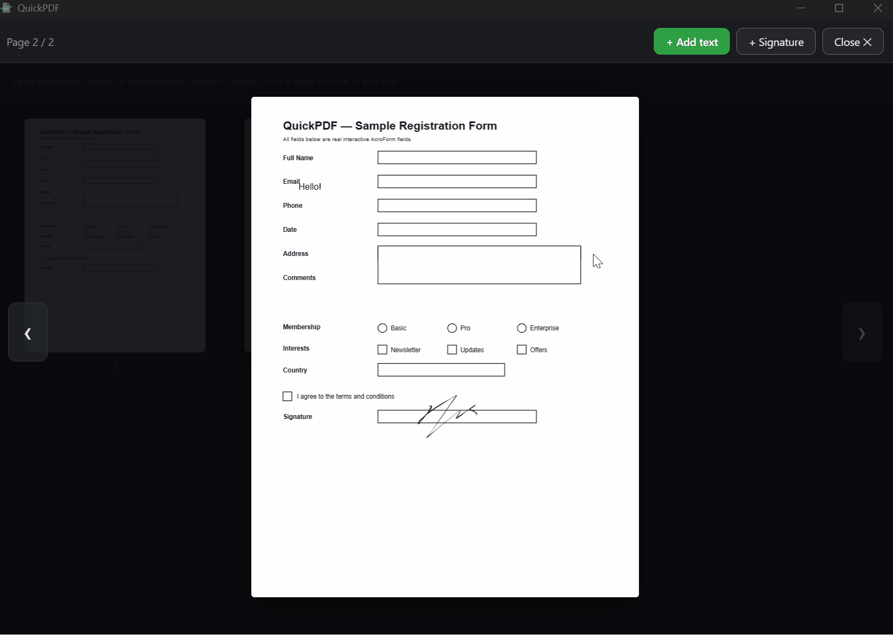

<p align="center">
  
</p>

A lightweight, **fully offline** PDF tool for personal use. Built because I hate using Adobe tools and wanted something snappier and lightweight. All PDF processing happens locally in the app;
files never leave your machine.

## Screenshots

<div align="center">
  <table>
    <tr>
      <td colspan="2" align="center">
        
        <br />
        <sub>Drag to reorder pages</sub>
      </td>
    </tr>
    <tr>
      <td align="center">
        
        <br />
        <sub>Add &amp; edit text</sub>
      </td>
      <td align="center">
        
        <br />
        <sub>Draw &amp; place signatures</sub>
      </td>
    </tr>
  </table>
</div>

## Features

- **Open & view** — open PDFs (button or drag-drop), every page as a crisp thumbnail, click any page for a large viewer with an **Enhance** contrast toggle for faint scans
- **Page management** — drag-to-reorder (single page or a whole multi-select block), rotate, delete; box-select with a marquee, or click + Ctrl-click
- **Page groups** — tag pages with color groups (an organizing aid that never changes the saved file): select, rename, gather, or move a group as a block, and export each group as its own PDF
- **Merge / Split / Extract** — combine multiple PDFs (open or drag several), extract selected pages to a new PDF, split into a folder of files
- **Text & forms** — stamp text anywhere + auto-detect & fill real AcroForm fields (text, checkbox, radio, dropdown), flattened on save
- **Signatures** — draw (with a trackpad **glide mode**) / upload / reusable saved library; place, drag, resize; baked in on save
- **Images** — insert PNG/JPG as pages; export selected pages as PNG (2×, overlays baked in)
- **Polish** — `.pdf` file association (double-click to open, single-instance), keyboard shortcuts (Ctrl+O/S, Ctrl+A, Delete, Esc), remembered window size, custom icon, logo-matched theme

## Tech stack

| Layer       | Choice                          | Role                                  |
| ----------- | ------------------------------- | ------------------------------------- |
| Shell       | **Tauri 2** (Rust)              | Tiny native window, dialogs, file I/O |
| UI          | **React + Vite + TypeScript**   | App interface                         |
| Render      | **pdf.js** (`pdfjs-dist` v6)    | Page previews / thumbnails            |
| Edit        | **pdf-lib**                     | Merge, split, reorder, stamp, forms   |
| Reorder     | **@dnd-kit**                    | Drag-and-drop page grid (M2)          |
| Signatures  | **signature_pad**               | Draw signatures (M5)                  |

### Architecture notes

- All editing runs in the webview (JavaScript). Rust only provides the native
  shell: `read_file` / `write_file` commands (efficient binary transfer) and the
  native open/save dialogs via `tauri-plugin-dialog`.
- pdf.js renders with a **top-left** origin (CSS px); pdf-lib writes with a
  **bottom-left** origin (PDF points). The coordinate transform between them is
  the key detail for text-stamping and signature placement (M4/M5).
- Native OS file-drop is disabled (`dragDropEnabled: false`) so HTML5
  drag-and-drop works inside the webview.
- pdf.js v6 decodes JBIG2/JPEG2000 scans via WASM that it doesn't auto-locate —
  those assets are copied from `node_modules/pdfjs-dist` into `public/pdfjs/` and
  pointed at via `wasmUrl`/`iccUrl`/`standardFontDataUrl` in `src/lib/pdfjs.ts`.
  (Re-copy them after upgrading `pdfjs-dist`.)
- Stamp/signature placement is converted to PDF coordinates with pdf.js's
  `viewport.convertToPdfPoint`, so it stays correct on pages with a `/Rotate`.
- The app icon is generated from `src-tauri/app-icon.svg` via `npm run tauri icon`.

## Development

```bash
npm install
npm run tauri dev     # compile Rust + launch the desktop app (first run is slow)
npm run build         # type-check + build the frontend only
npm run tauri build   # produce a distributable installer
```

Requires Node.js and the Rust toolchain
